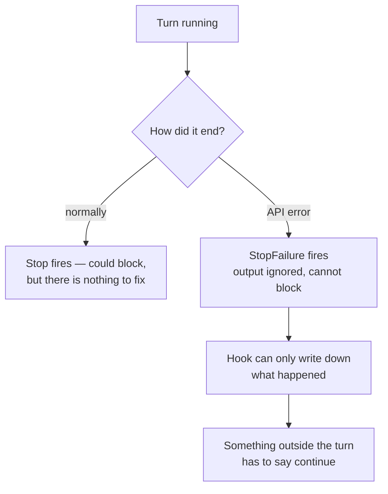
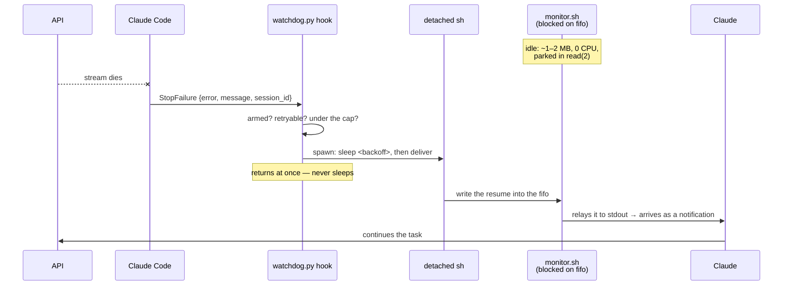
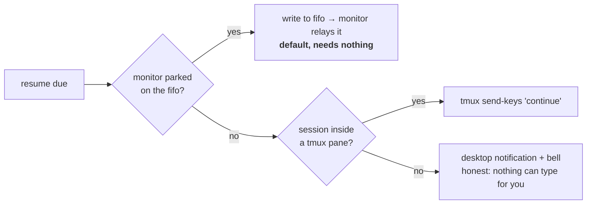
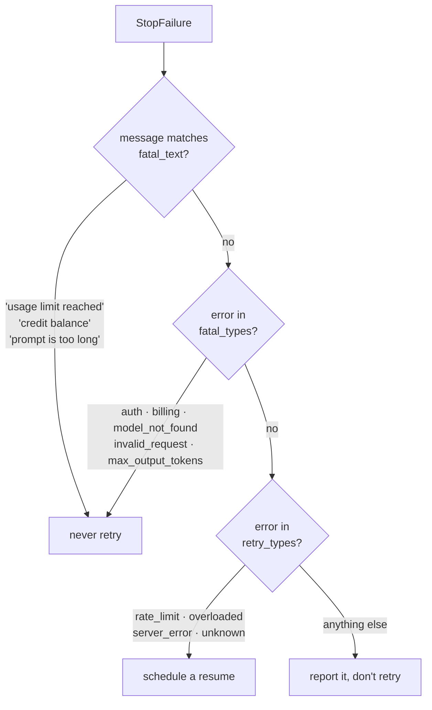

# claude-watchdog

A watchdog timer for Claude Code. When the API drops a turn, it resumes it, so an
unattended run keeps going instead of sitting at

```
⏺ API Error: The response stopped arriving. The response above may be incomplete.
```

until you come back and type `continue`.

Nothing to install beyond the plugin. macOS and Linux. The part that stays resident
costs **~1–2 MB and zero CPU**, and tmux is optional.

## Install

From inside a Claude Code session:

```
/plugin marketplace add fuadnafiz98/claude-watchdog
/plugin install watchdog@claude-watchdog
```

Restart the session (monitors start at session start), then arm it:

```
/watchdog on
```

Off by default — auto-continuing is what you want overnight, not while you're watching.
Run `/watchdog` to see whether the in-band channel is actually live.

## Why it isn't just a hook

Claude Code ends a turn with one of two events, and the difference is the whole design:

| Event | Fires when | Can it block the stop? |
| --- | --- | --- |
| `Stop` | Claude finishes normally | yes |
| `StopFailure` | the turn dies on an API error | **no** |

An API error fires **only** `StopFailure`, whose output is discarded. So a hook cannot
refuse to stop and cannot say "continue". The resume has to arrive from *outside* the
dead turn.



## How it works

Two halves. A resident relay that does nothing until spoken to, and a hook that only
runs when something breaks.



1. **The stream dies.** `StopFailure` fires with the error already classified:
   `{"error": "server_error", "last_assistant_message": "API Error: The response stopped
   arriving", "session_id": "…"}`.
2. **The hook decides** — armed, retryable error, under the retry cap — writes one small
   incident file and returns. It never sleeps: a hook whose output is thrown away gains
   nothing by blocking the session.
3. **A detached `sh` waits out the backoff.** During the wait the only cost is `sh` and
   `sleep`, not a Python interpreter.
4. **It writes the resume into a fifo**, which the resident `monitor.sh` is parked on.
   Monitor stdout reaches Claude as a notification — the in-band way to wake a waiting
   session.
5. **Claude picks up** where it stopped, told to re-check anything that was mid-flight
   rather than restart.

### Finding the right session, without calling the CLI

Both halves need to agree on one fifo. They walk up their own process tree with `ps`
until they find the owning `claude` process, and name the fifo after its pid. The hook
is spawned by that same process, so both sides land on the same answer without either
shelling out to `claude agents --json` (which would start a second Node process on every
API error).

The command *name* is compared exactly. Searching the whole argv for "claude" looks
equivalent and is not: any ancestor shell whose command line merely mentions such a path
matches, and the walk stops on the shell. That bug shipped once and is now a test.

## Delivery without tmux



| Channel | Needs | When |
| --- | --- | --- |
| `monitor` | nothing | default, whenever the monitor is listening |
| `tmux` | tmux | monitor missing — e.g. session not restarted since install |
| notify | nothing | neither available; it says so instead of pretending |

Availability is not guessed: the sender opens the fifo `O_WRONLY|O_NONBLOCK` and `ENXIO`
means no monitor is listening. `monitor.sh` therefore holds the fifo **`O_RDWR`**, not
read-only — on Darwin a reader merely parked in `open(2)` does not satisfy that
non-blocking open, so a read-only monitor is invisible and every resume silently falls
back to tmux. Force a channel with `watchdog set channel monitor` (or `tmux`).

## What it retries

The `error` field drives the decision, and the message text is checked *first*.



Text before type, because a spent quota arrives as `rate_limit` — retrying that hourly in
60-second steps is pointless. An error type in neither list is reported and **not**
retried.

Backoff `5 → 15 → 30 → 60 → 120s`, 60s floor for rate limits and overload, 8 retries per
session, counter resets after 12 idle hours.

## Requirements

No packages, no runtime to install, nothing compiled.

| Needs | Where it's used | Notes |
| --- | --- | --- |
| POSIX `sh` | the resident monitor | verified under both `dash` and bash-as-`sh` |
| `ps`, `mkfifo`, `tr` | session correlation, the fifo | base system on macOS and Linux |
| `python3` | hook, delivery, CLI — never resident | present on any machine with a dev toolchain |
| `tmux` | fallback channel only | optional |
| `osascript` / `notify-send` | last-resort notification | optional; falls back to a bell |

`watchdog doctor` prints this as a checklist for the machine you're on.

## Footprint

Measured on macOS, 4 seconds after start, idle:

| | Resident | CPU while idle | Wakeups |
| --- | --- | --- | --- |
| First version (Python, polling) | 18.4 MB | timer every 2s | ~30/min |
| **Now (`sh` on a fifo)** | **1.3 MB** (dash) / 2.1 MB (bash-as-sh) | **0.00s** | **none** |

Two changes got the 10×, and neither was a faster language:

- **The interpreter left the resident path.** CPython's floor is 14.5 MB before your code
  exists (`python3 -c pass`), so no amount of optimising a Python daemon gets near 2 MB.
  `sh -c :` is 1.9 MB.
- **The poll became a block.** There is no interval and no heartbeat file. The monitor is
  parked in `read(2)` on a fifo and the kernel wakes it when a resume is written; a
  heartbeat *file* would mean timers, and a heartbeat *line* would cost tokens, since
  every line a monitor prints becomes a notification.

**Why not Rust?** A static Rust binary would land near 1 MB — perhaps 0.3–1 MB below
`dash`, both rounding to nothing against the session that hosts it. In exchange the
plugin would need per-platform binaries committed to the repo or a `cargo build` on
install, replacing "clone it and it runs". The win here came from deleting work, not from
changing language, so the language stays boring on purpose.

## What it costs in tokens

| Part | Model calls | Token cost |
| --- | --- | --- |
| `StopFailure` hook | none | **zero** |
| Monitor while idle | none | **zero** — it prints nothing |
| One delivered resume | one new turn | same as typing `continue` yourself |

The expense is a *failed* retry: 8 attempts that all die is 8 turns of input for no
progress. The cap, the backoff and the fatal lists exist to bound that. `unknown` is the
one speculative entry in `retry_types` — it's there so an uncatalogued transient error
still recovers. To stop paying for guesses:

```sh
watchdog set retry_types rate_limit,overloaded,server_error
watchdog set max_retries 3
```

## Configuration

Precedence: **`WATCHDOG_<KEY>` env var → config file → default.**

```sh
watchdog config                  # effective values, changed ones marked
watchdog set max_retries 20
watchdog set backoff 10,30,60    # lists take commas
watchdog set channel monitor     # auto | monitor | tmux
watchdog set resume_message "keep going ({attempt}/{max_retries})"
```

| Key | Default | Meaning |
| --- | --- | --- |
| `enabled` | `false` | armed or not (`watchdog on` / `off`) |
| `max_retries` | `8` | retries per session before giving up |
| `backoff` | `[5,15,30,60,120]` | seconds per attempt; last value repeats |
| `slow_floor` | `60` | minimum wait for `slow_types` |
| `slow_types` | `rate_limit, overloaded` | error types that get the floor |
| `retry_types` | `rate_limit, overloaded, server_error, unknown` | retried |
| `fatal_types` | auth, oauth, billing, invalid_request, model_not_found, max_output_tokens | never retried |
| `fatal_text` | usage limit reached, credit balance, … | message substrings that veto a retry |
| `channel` | `auto` | `auto`, `monitor`, or `tmux` |
| `counter_ttl_hours` | `12` | idle time before the retry counter resets |
| `resume_message` | see `watchdog config` | `{attempt} {max_retries} {error} {message}` |

State lives in `~/.claude/watchdog/` (override with `WATCHDOG_HOME`), so reinstalling the
plugin keeps your settings, counters and log.

Plugin `userConfig` is deliberately unused: those values reach hooks but **not** monitors,
which would leave the two halves disagreeing about one setting.

## Commands

```
/watchdog                # doctor: requirements, listening monitors, pending resumes
/watchdog on | off
```

`watchdog` is also on the Bash tool's PATH while the plugin is enabled, and works from
your own shell:

```sh
watchdog doctor
watchdog log 20
watchdog reset           # clear counters and pending resumes
watchdog test            # 61 checks
```

## Files

```
scripts/monitor.sh      resident relay: POSIX sh parked on a fifo
scripts/watchdog.py     hook, delivery, doctor, config — only runs on demand
hooks/hooks.json        StopFailure → watchdog.py hook
monitors/monitors.json  watchdog-resume → monitor.sh
commands/watchdog.md    /watchdog
tests/test_watchdog.py  61 checks
```

## Verified vs not

On macOS, Claude Code 2.1.234:

- `Stop` does **not** fire on an API error; `StopFailure` does. Probed with a real failing
  turn and hooks on both events, not inferred from docs.
- The `StopFailure` payload shape above, including the classified `error` field.
- **The whole no-tmux path, end to end**: `monitor.sh` running, a real `StopFailure`
  payload into the hook, the resume text arriving on the monitor's stdout — under `dash`
  and under bash-as-`sh`.
- Monitor stdout reaching Claude as a notification, confirmed separately in a live session.
- tmux delivery end to end: pane resolved by walking the process tree, `continue\n` landed
  on the target program's stdin.
- Session correlation resolving the same pid `claude agents --json` reports.
- Footprint numbers in the table above.
- 61 checks in `tests/test_watchdog.py`; 16 deliberate mutations of the source are each
  caught by them.

Not verified: Linux at runtime — the shell is checked under `dash` and every tool used is
base-system, but the plugin has not been exercised on a Linux host. A live
`The response stopped arriving` cannot be triggered on demand either, so which `error`
type it maps to is inferred; `server_error` and `unknown` are both retryable, which is why
both are in the list.

For a fully unattended run with no TUI at all, a `claude -p --resume` retry loop is
sturdier than any in-session mechanism. This plugin is for leaving a live session working.

## License

MIT
