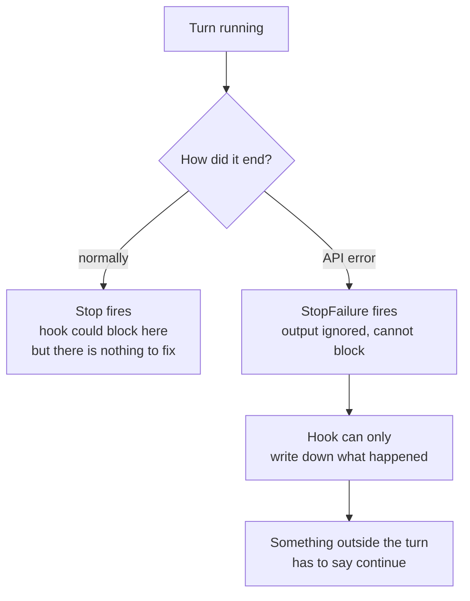
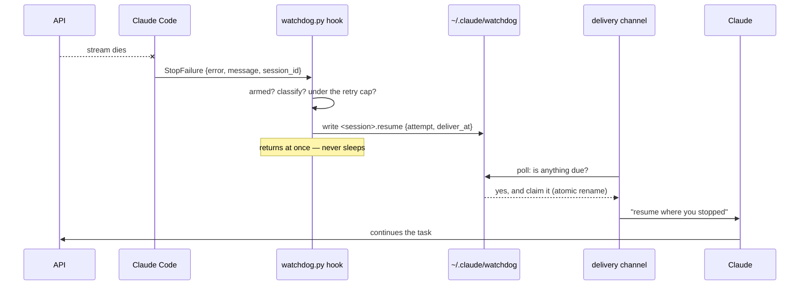
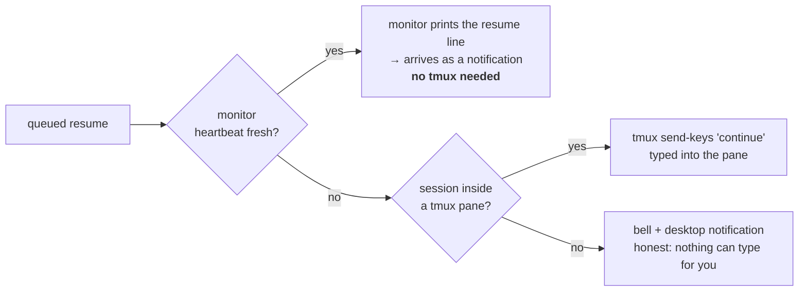

# claude-watchdog

Resumes a Claude Code turn that the API killed, so an unattended run keeps going
instead of sitting at

```
⏺ API Error: The response stopped arriving. The response above may be incomplete.
```

until you come back and type `continue`.

One script, one hook, one monitor. **tmux is not required.**

## Install

```
/plugin marketplace add fuadnafiz98/claude-watchdog
/plugin install watchdog@claude-watchdog
```

Restart the session (monitors only start at session start), then arm it:

```
/watchdog on
```

Off by default — auto-continuing is what you want overnight, not while you're watching.
Check it with `/watchdog`, which prints which delivery channel is actually live.

## Why it isn't just a hook

Claude Code ends a turn with one of two events, and the difference is the entire design:

| Event | Fires when | Can it block the stop? |
| --- | --- | --- |
| `Stop` | Claude finishes normally | yes |
| `StopFailure` | the turn dies on an API error | **no** |

An API error fires **only** `StopFailure`, whose output is discarded. So a hook cannot
refuse to stop, cannot sleep usefully, and cannot say "continue". The resume has to be
delivered from *outside* the dead turn.



## The flow, end to end



Step by step:

1. **The stream dies.** Claude Code fires `StopFailure` with the error already
   classified: `{"error": "server_error", "last_assistant_message": "API Error: The
   response stopped arriving", "session_id": "…"}`.
2. **The hook decides.** Armed? Is this error type worth retrying? Still under the cap?
   If yes it writes one small file, `<session-id>.resume`, stamped with `deliver_at =
   now + backoff`. It returns immediately — sleeping in a hook whose output is thrown
   away would only stall the session.
3. **A channel picks it up** once `deliver_at` passes, claiming it with an atomic
   rename so two channels can never resume the same turn twice.
4. **Claude gets a message** saying the turn was cut off mid-work: pick up where it
   stopped, re-check anything that was in flight, don't restart.

## Delivery without tmux

The default channel needs no tmux and no terminal tricks. Plugin monitors run a
background command whose **stdout lines are delivered to Claude as notifications** —
that is the in-band way to reach a waiting session.



| Channel | Needs | When it's used |
| --- | --- | --- |
| `monitor` | nothing | default, whenever the monitor's heartbeat is fresh |
| `tmux` | tmux | monitor missing (plugin just installed, session not restarted) |
| notify | nothing | neither available — it says so instead of pretending |

The monitor writes a heartbeat every poll, so the hook can tell whether the in-band
channel is actually alive rather than assuming it. Force one with
`watchdog set channel monitor` (or `tmux`).

## What it retries

The `error` field from `StopFailure` drives the decision, and the message text is
checked *first*.


Text before type, because a spent quota arrives as `rate_limit` — retrying that for an
hour in 60-second steps is pointless. An error type in neither list is reported and
**not** retried; widening the list is your call, and it's one command.

Backoff `5 → 15 → 30 → 60 → 120s`, with a 60s floor for rate limits and overload,
capped at 8 retries per session. Counters reset after 12 idle hours.

## What it costs

The machinery is free. The retry is not — it costs exactly what typing `continue`
yourself costs, because it *is* that.

| Part | Model calls | Token cost |
| --- | --- | --- |
| `StopFailure` hook | none | **zero** — plain Python, runs and exits |
| Monitor while idle | none | **zero** — see below |
| One delivered resume | one new turn | one turn's input + output, same as typing `continue` |

Idle really is zero, by design: the monitor's liveness signal is a **file touch, not a
stdout line**. Every line a monitor prints becomes a notification in the conversation,
so a heartbeat printed to stdout would quietly add tokens every few seconds, all night,
forever. It writes to disk instead and only ever prints when there is a resume to
deliver.

What is not free is the retry itself. Resuming re-sends the conversation, so a retry on
a large context is a large input — mostly prompt-cache reads if the retry lands inside
the cache window, which the 5–120s backoff is chosen to stay inside. The cost that
actually bites is a **failed** retry: 8 attempts that all die is 8 turns of input for
no progress. Three things bound it:

- the retry cap (`max_retries`, default 8),
- the fatal lists, which refuse the errors that would fail identically every time,
- and `unknown` being the one speculative entry in `retry_types` — it is there so a
  genuinely transient error nobody has catalogued still recovers. If you would rather
  not pay for guesses, remove it:

```sh
watchdog set retry_types rate_limit,overloaded,server_error
watchdog set max_retries 3     # cheaper ceiling on a huge context
```

Every attempt is logged with its cost driver (attempt number and error), so
`watchdog log` tells you whether retries are recovering work or burning context.

## Configuration

Every knob is a config key. Precedence: **`WATCHDOG_<KEY>` env var → config file → default.**

```sh
watchdog config                              # effective values, changed ones marked
watchdog set max_retries 20
watchdog set backoff 10,30,60                # lists take commas
watchdog set retry_types server_error,overloaded,unknown
watchdog set channel monitor                 # auto | monitor | tmux
watchdog set resume_message "keep going ({attempt}/{max_retries})"
```

| Key | Default | Meaning |
| --- | --- | --- |
| `enabled` | `false` | armed or not (`watchdog on` / `watchdog off`) |
| `max_retries` | `8` | retries per session before giving up |
| `backoff` | `[5,15,30,60,120]` | seconds per attempt; last value repeats |
| `slow_floor` | `60` | minimum wait for `slow_types` |
| `slow_types` | `rate_limit, overloaded` | error types that get the floor |
| `retry_types` | `rate_limit, overloaded, server_error, unknown` | retried |
| `fatal_types` | auth, oauth, billing, invalid_request, model_not_found, max_output_tokens | never retried |
| `fatal_text` | usage limit reached, credit balance, … | message substrings that veto a retry |
| `channel` | `auto` | `auto`, `monitor`, or `tmux` |
| `poll_seconds` | `2` | monitor poll interval |
| `heartbeat_stale` | `30` | seconds before the monitor counts as down |
| `counter_ttl_hours` | `12` | idle time before the retry counter resets |
| `resume_message` | see `watchdog config` | template: `{attempt} {max_retries} {error} {message}` |

Config and state live in `~/.claude/watchdog/` (override with `WATCHDOG_HOME`), so updating or
reinstalling the plugin keeps your settings, counters, and log.

Plugin `userConfig` is deliberately not used: those values reach hooks but **not**
monitors, which would leave the two halves disagreeing about the same setting.

## Commands

```
/watchdog                 # doctor: which channel is live, per session
/watchdog on | off
```

`watchdog` is also on the Bash tool's PATH while the plugin is enabled, and works from your
own shell:

```sh
watchdog doctor           # armed? monitor up? tmux reachable? anything queued?
watchdog log 20
watchdog reset            # clear counters, queued resumes, heartbeats
watchdog test             # 53 checks
```

Start with `watchdog doctor`. If a session shows `would use: none - cannot resume`, restart
it so the monitor comes up.

## Files

```
scripts/watchdog.py       everything: hook, monitor, tmux sender, doctor, config
bin/watchdog              two-line shim onto that script
hooks/hooks.json     StopFailure → watchdog.py hook
monitors/monitors.json  watchdog-resume → watchdog.py monitor
commands/watchdog.md      /watchdog
tests/test_watchdog.py    53 checks
```

## Verified vs not

Verified on macOS, Claude Code 2.1.234:

- `Stop` does **not** fire on an API error; `StopFailure` does. Probed with a real
  failing turn and hooks on both events — not inferred from docs.
- The `StopFailure` payload shape above, including the classified `error` field.
- **Monitor stdout reaches Claude as a notification** — armed a background monitor,
  and its line arrived as a live notification 150s later.
- tmux delivery end to end: pane resolved by walking the process tree from session pid
  to `pane_pid`, `continue\n` landed on the target program's stdin, request drained once.
- Classification, backoff, cap, per-session counters, single-claim race, config
  precedence, malformed input: 53 checks, and 14 deliberate mutations of the source are
  each caught by them.

Not verified: a live `The response stopped arriving` — it can't be triggered on demand,
so the error type it maps to is inferred (`server_error` and `unknown` are both in the
retry list, which is why both are there).

For a fully unattended run with no TUI at all, a `claude -p --resume` retry loop is
sturdier than any in-session mechanism. This plugin is for leaving a live session
working overnight.

## License

MIT
